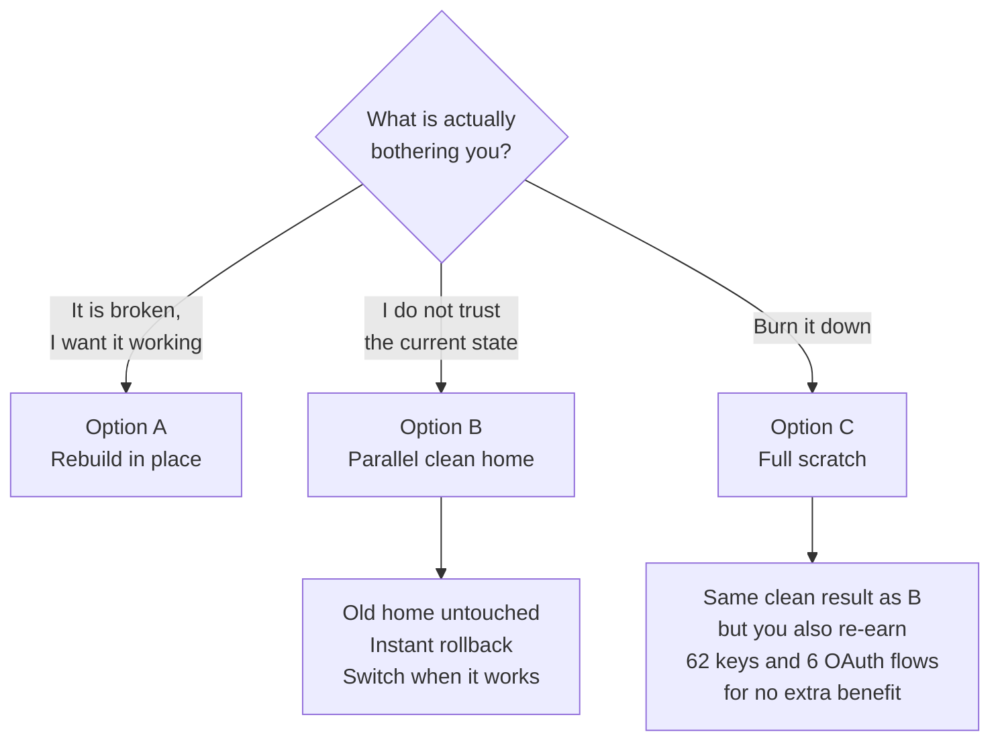

> **STATUS (2026-09-09):** Archived — superseded by 2026-08-21-hermes-option-b-handoff.md (Option B executed).

# Rebuild vs. Start Over — Decision Handoff

**Written:** 2026-08-20
**Question:** Is it cheaper to repair the current Hermes install, or start clean?
**Answer:** There are three options, not two — and the middle one dominates the option you were actually asking about.

---

## Correction to earlier numbers

Two figures repeated in earlier sessions were wrong. Measured directly:

| Claim in earlier reports | Actual |
|---|---|
| "243 API keys in `.env`" | **62 keys** (532 lines, mostly comments) |
| snapshot cron jobs "6" or "2" | **27 jobs** (`jobs.json` is `{jobs: [...], updated_at}` — naive `len()` returns 2) |

62 keys and 6 OAuth providers is a meaningfully smaller hill than 243. It changes the calculus below.

---

## The three options

**Option A — Rebuild in place.** The current six-session plan. Hybrid sources: config + 27 cron jobs from the surviving state snapshot, souls from `hermes-fleet`, memory from the backup tree.

**Option B — Parallel clean home.** Build a brand-new `HERMES_HOME` at, say, `~/.hermes-clean`, alongside the existing one. Configure it deliberately, from as close to zero as you like. Switch over when it works. **The current install is never touched, so rollback is instant.**

This is supported mechanics, not a hack — it is exactly how profiles already work. A profile *is* a relocated `HERMES_HOME`, set by a generated wrapper. `hermes gateway install` even names alternate-home services `ai.hermes.gateway-<suffix>`, so a second gateway can coexist.

**Option C — Full scratch.** `hermes uninstall --full`, reinstall, reconfigure everything by hand.

---

## What each option makes you re-earn

| Asset | A — Rebuild | B — Parallel clean | C — Full scratch |
|---|---|---|---|
| 62 `.env` keys | kept | one `cp` | **re-earn all 62** |
| 6 OAuth providers (`auth.json`) | kept | one `cp` | **re-auth all 6** |
| 12 MCP tokens | kept | one `cp` | **re-auth** |
| 22 profile credential sets | kept | copy what you keep | **re-earn** |
| `config.yaml` — 1,475 lines | from snapshot | snapshot, or start minimal | **hand-write** |
| 27 cron jobs | from snapshot | snapshot, or a chosen subset | **recreate by hand** |
| Cron scripts | fleet | fleet | fleet |
| 23 souls | 17 from fleet, 6 unknown | bring only what you want | same |
| 246 memory `.md` files | from backup | optional | **gone** |
| 1,153 sessions, 78 memory facts | kept | not carried by default | **gone** |
| 1.8 GB of DB bloat | carried (vacuum deferred) | **shed** | **shed** |
| Unknown-state risk | **remains** | **eliminated** | eliminated |
| Rollback if it goes wrong | restore pre-deploy copies | **old home still live** | none |

---

## The finding that matters

**Option C buys you nothing that Option B doesn't.**

Both end with a clean, deliberately-built home. The only difference is that C additionally destroys 62 keys, 6 OAuth sessions, and 12 MCP tokens — and removes your ability to roll back. Every "start fresh" benefit you want (no mystery state, fewer profiles, no DB bloat, a config you understand) is available in B while the working install sits untouched next door.

Credentials are the one asset that costs real human time to replace, and they are the one asset a fresh `HERMES_HOME` can inherit with a single copy. There is no version of "start over" that is improved by re-running OAuth flows.

**So the real decision is A vs. B**, and it turns on one question: *is the current install's state something you distrust, or just something that is currently incomplete?*

---

## Recommendation

**Choose B if** any of these are true — and from the last several hours, at least two are:
- You do not trust that the current install is free of leftovers from two overlapping reset passes.
- You want fewer than 23 profiles and this is a natural pruning moment.
- The 106-byte `config.yaml` that appeared at 22:17 unprompted bothers you. *(It should — something wrote it after the plan was authored, and nobody has explained what.)*

**Choose A if** you mainly want the bots back online and are content to defer cleanup. It is fewer decisions and reuses everything.

**Choose C only if** you specifically want the credentials gone — a key rotation, or handing the machine off.

---

## What Option B actually looks like

Roughly three sessions instead of six, because most of the work is choosing rather than repairing.

**B0 — Stand up the empty home.**
`export HERMES_HOME=~/.hermes-clean`, verify with `hermes config path` that you are writing where you think. Confirm the existing install is unaffected.

**B1 — Bring credentials across.** Copy `.env`, `auth.json`, `shared/`, `mcp-tokens/` from the live home. This is the only step that is pure copy, and it is the step that saves the most time.

**B2 — Configure deliberately.** Either start from built-in defaults and add only what you want, or seed from the snapshot's 1,475-line config and prune. Deploy souls from fleet for the profiles you decide to keep. Add back only the cron jobs you still want out of the 27.

**B3 — Cut over.** `hermes gateway install` against the new home, verify, then retire the old one. The old `~/.hermes` stays on disk as rollback until you are satisfied.

**Carry-over decisions to make explicitly, not by default:**
- Which of the 23 profiles survive?
- Which of the 27 cron jobs are still wanted?
- Do the 246 memory files come across, or is this a clean memory start?
- Do the 1,153 sessions matter to you, or is losing that history fine?

---

## Unchanged either way

- **Session 0 of the existing plan still applies first.** 95 files remain deleted from `hermes-fleet/scripts/mini/` and are one stray `git commit -a` from permanent. Run `git checkout -- scripts/mini/` regardless of which option you pick.
- **Never run `restore-hermes.py`.** It would write 23 stub SOULs over real personas and report success.
- **Credentials are never destroyed** in A or B. Only C does that, deliberately.
- Full detail on the repair path lives in `~/hermes-rebuild-plan.md`.
