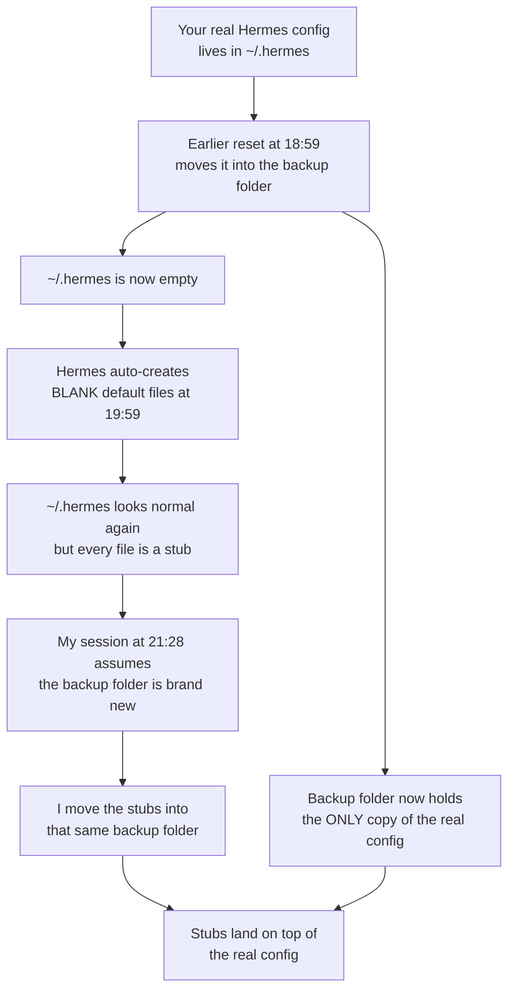
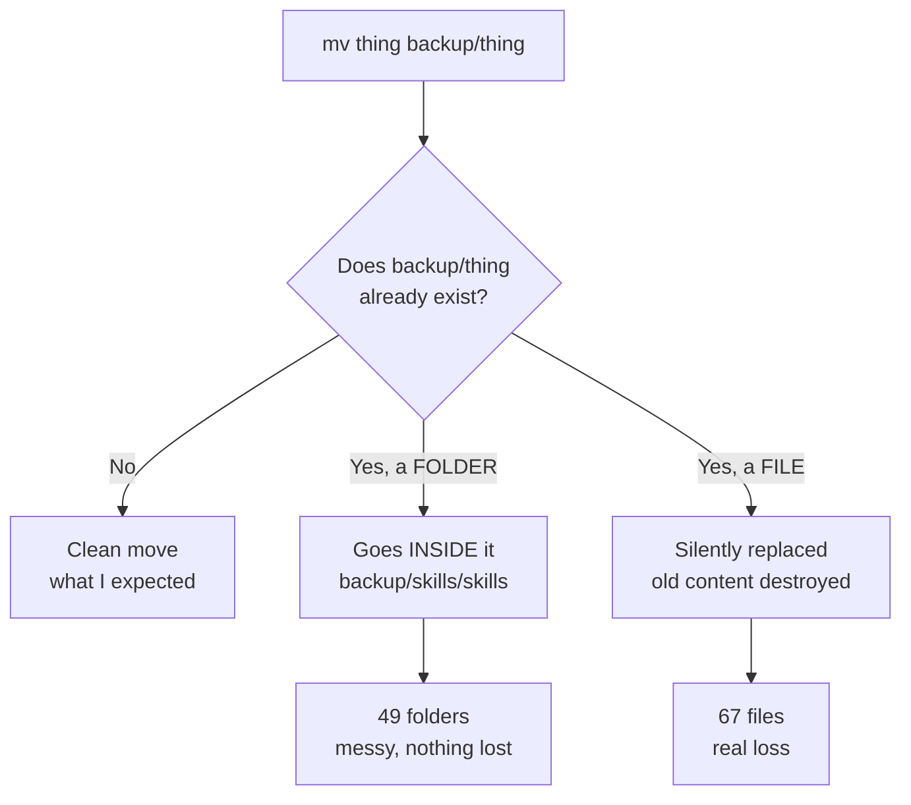
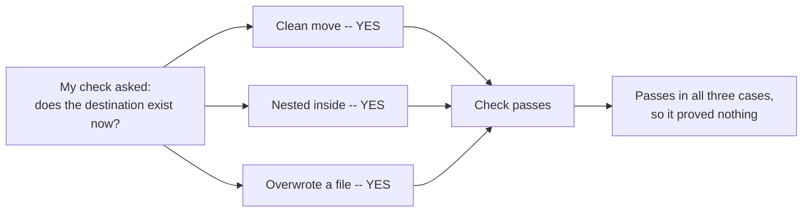
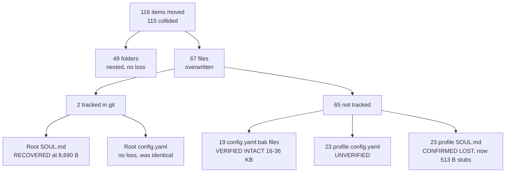
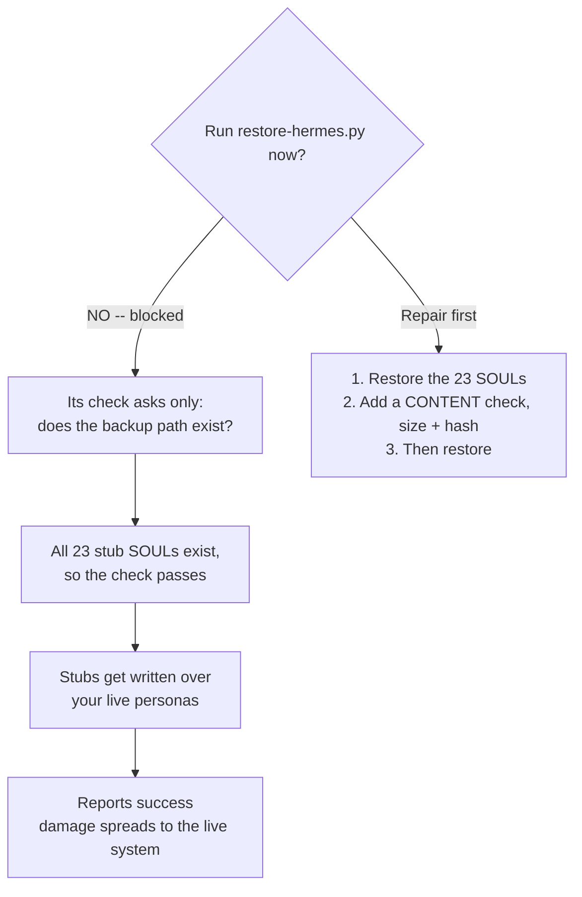

> **STATUS (2026-09-09):** ⚠️ ACTIVE RULE: never run restore-hermes.py until the 23 backed-up SOUL.md files are verified repaired (the script checks existence, not content).

# Hermes Backup Incident — Handoff

**Date of incident:** 2026-08-20
**Backup directory:** `/Users/stephenbowman/agent-config-backup-2026-08-20`
**Status:** Contained. Nothing is actively degrading. One repair is required before any restore.

---

## Read this first

A config reset ran twice on the same day, by two different agents, into the same backup folder. The second pass (mine) overwrote part of the first pass's backup with blank placeholder files.

**The blocking rule:**

> **Do not run `restore-hermes.py` until the 23 profile `SOUL.md` files in the backup have been repaired.**

Right now that script would copy 513-byte stubs over your real agent personas and report success, because its verification checks that backup paths *exist* — not what is inside them.

---

## What happened, in plain terms

Think of it as a filing cabinet.

The first reset emptied your Hermes config drawer into a storage box. That box then held the **only** copy of your real config. Hermes noticed the drawer was empty and helpfully refilled it with **blank forms**.

My session came along, saw a full-looking drawer, and assumed the storage box was new and empty. I emptied the drawer of blank forms into the same box — landing on top of your real documents.

**Root cause:** I created the backup folder with `mkdir -p`. That command succeeds silently when the folder already exists. It did exist. Nothing warned me.

---

## Why folders survived but files did not

`mv` behaves in two completely different ways depending on what is already at the destination. This single difference explains the whole damage pattern.

Folders got **nested** (`backup/skills/skills`) — ugly, but every original survived.
Files got **replaced** — the original content is gone.

---

## Why my verification did not catch it

After each move I checked: *does the destination exist now?*

That question returns "yes" for a clean move, a nested move, **and** an overwrite. It cannot distinguish success from damage.

The right check compares the destination's **content** (size and hash) before and after, or refuses to write to a path that already exists.

---

## Exact damage ledger

I moved 116 items. 115 of them landed on paths the first pass had already backed up.

| Category | Count | Status |
|---|---:|---|
| Folders nested | 49 | No loss |
| Root `SOUL.md` | 1 | Recovered from git (8,690 B) |
| Root `config.yaml` | 1 | No loss — my copy was byte-identical |
| `config.yaml.bak-*` files | 19 | Verified intact (16–36 KB each) |
| Profile `config.yaml` | 23 | **Unverified** — check before trusting |
| Profile `SOUL.md` | 23 | **Confirmed lost** — all now 513-byte stubs |

Evidence for the confirmed loss:

| Profile | In backup now | Real persona in `hermes-fleet` |
|---|---:|---:|
| analyst | 513 B | 3,406 B |
| critic | 513 B | 5,982 B |
| sysop | 513 B | 4,349 B |
| studio | 513 B | 5,946 B |

---

## The trap in the current restore path

The later audit session reported: *"All 627 backup paths were independently verified to exist."*

That is the same weak check I used. It passes on every one of the 23 stub files.

---

## Recovery sources

`~/repos/hermes-fleet/souls/bots/<name>.SOUL.md` is git-tracked and covers **17 of 23** profiles:

`analyst, archivist, bookie, builder, critic, curator, design, pocock, reader, reviewer, scoreboard, scout, scribe, studio, swarm-forge, sysop, workbench`

Confidence check: `hermes-fleet/souls/mini.SOUL.md` is byte-identical (8,690 B) to the root `SOUL.md` recovered from git. The mapping is verified, not assumed. (This host is the Mac mini, fleet identity `mini`. `macbook.SOUL.md` is byte-identical to `mini.SOUL.md`, so either filename yields the same content — but `mini` is the correct one.)

**No source found for 6:** `backend`, `cfblocalworker`, `frontend`, `ops`, `pliny`, `researcher`
Check `hermes-fleet` git history before concluding these are gone. If nothing exists, record them as lost — do **not** substitute stubs.

---

## Plan

**Phase 0 — Repair the backup. Blocking.**
1. Replace existence checks with content checks (size + hash) across the 627-item manifest.
2. Restore the 17 profile SOULs from `hermes-fleet`.
3. Search `hermes-fleet` git history for the remaining 6.
4. Verify the 23 profile `config.yaml` files — status currently unknown.
5. Re-run verification. It must **fail** on any 513-byte `SOUL.md`.

**Phase 1 — Restore.** Run `restore-hermes.py` only after Phase 0 passes clean.

**Phase 2 — Re-measure.** The token audit was taken against a stripped system and its numbers do not describe your real configuration. Re-measure after restore.

**Phase 3 — Optimize.** Only against post-restore numbers.

---

## Never touch

- `~/.hermes/.env` and backups, `auth.json` and backups, `auth/`, `shared/`, Google OAuth files, `mcp-tokens/`, `secrets/`
- Per-profile `.env` and `auth.json`
- `sessions/`, logs, `state.db`, `lcm.db`, `memory_store.db`, `verification_evidence.db`, caches, pairing data
- `~/repos/cfb-model-lab` and its git state
- The backup directory itself

**Verified:** no credential or session file was moved at any point, at root or in any of the 23 profiles. Sign-in state is intact.

---

## Note on the token audit

The audit concluded *"no config.yaml exists — running on pure defaults — this is actually optimal."* That is a reset artifact, not a steady state: `config.yaml` is absent because it was moved to the backup. The measured `SOUL.md` cost of ~128 tokens reflects the 513-byte stub; the real root SOUL is 8,690 B (~2,170 tokens), plus 23 profile SOULs at 3.4–6 KB each.

Its one per-turn finding — tool schema cost — was inferred by subtraction (`58,049 − 16,750 − 2,495 ≈ 39,000`), never isolated from conversation tokens. Measure per-toolset schema size directly before cutting anything.
